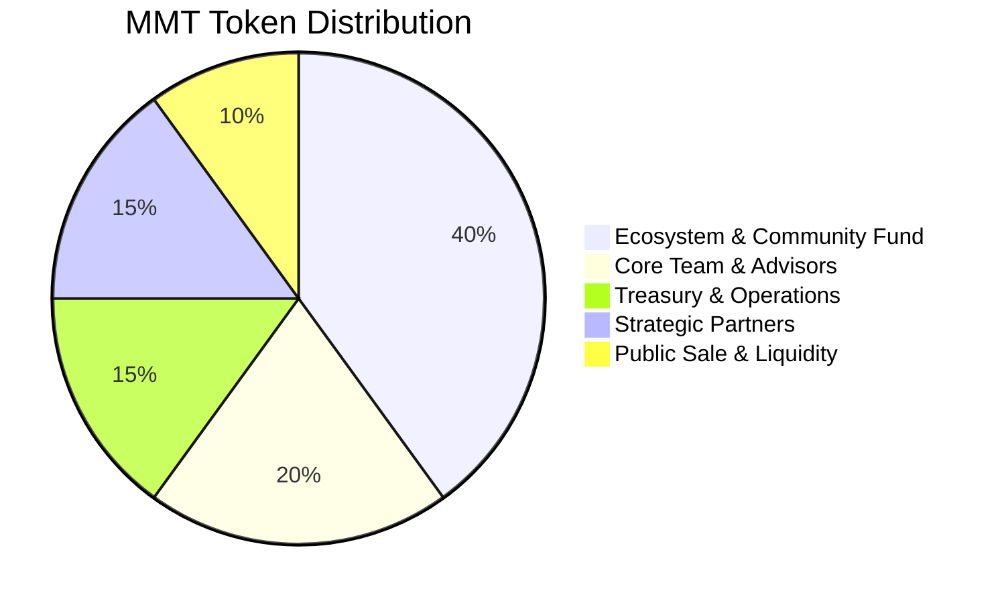
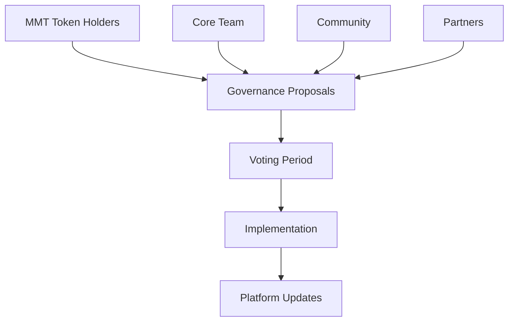

# Ecosystem & Token

This section covers the MMT token ecosystem, governance mechanisms, and the path toward a fully decentralized Momentmm platform. The MMT token is designed as a utility token that provides tangible benefits to active participants while fostering a self-sustaining, community-governed ecosystem.

## MMT Token Overview

The **Momentmm Token (MMT)** is the native utility token of the Momentmm platform, designed to align incentives across all participants and unlock advanced features for active users.

### Token Specifications

```yaml
Token Details:
  Name: Momentmm Token
  Symbol: MMT
  Standard: ERC-20 (Polygon)
  Total Supply: 1,000,000,000 MMT
  Decimals: 18
  Network: Polygon Mainnet
```

### Token Utility

MMT serves multiple functions within the Momentmm ecosystem:

#### 1. Governance Rights
- **Voting Power**: Participate in platform governance decisions
- **Proposal Creation**: Submit proposals for platform improvements
- **Parameter Control**: Vote on fee structures, feature priorities, and allocations

#### 2. Platform Benefits
- **Fee Discounts**: Reduced transaction fees for MMT holders
- **Priority Access**: Early access to high-demand events
- **Staking Rewards**: Earn rewards for locking MMT tokens
- **Premium Features**: Access to advanced organizer tools

#### 3. Payment Method
- **Native Payments**: Use MMT for ticket purchases and fees
- **Royalty Payments**: Creators can receive royalties in MMT
- **Reward Distribution**: Airdrops and rewards distributed in MMT

## Tokenomics

### Supply Distribution

The MMT token supply is allocated to support long-term growth and community engagement:



#### Detailed Allocation

**Ecosystem & Community Fund (40% - 400M MMT)**
- User incentives and rewards programs
- Marketing and community building
- Liquidity provision and market making
- Developer grants and ecosystem development
- Airdrops to early adopters and active users

**Core Team & Advisors (20% - 200M MMT)**
- Multi-year vesting schedule (4-year linear vesting)
- 1-year cliff period
- Ensures long-term alignment with platform success
- Performance-based milestone releases

**Treasury & Operational Reserves (15% - 150M MMT)**
- Ongoing operational expenses
- Platform development and maintenance
- Legal and regulatory compliance
- Emergency reserves and contingencies

**Strategic Partners & Early Backers (15% - 150M MMT)**
- Early investors and strategic partners
- Industry partnerships and integrations
- Advisory board compensation
- Strategic reserve for future partnerships

**Public Sale & Liquidity Generation (10% - 100M MMT)**
- Initial public offering
- Liquidity pool establishment
- Exchange listings and market making
- Broad distribution to community

### Vesting Schedule

```yaml
Vesting Details:
  Team & Advisors:
    Cliff: 12 months
    Duration: 48 months
    Release: Linear monthly
    
  Strategic Partners:
    Cliff: 6 months
    Duration: 24 months
    Release: Linear monthly
    
  Treasury:
    Cliff: 0 months
    Duration: 36 months
    Release: Linear monthly
    
  Public Sale:
    Cliff: 0 months
    Duration: 0 months
    Release: Immediate
```

## Governance Framework

### Decentralized Autonomous Organization (DAO)

The long-term vision for Momentmm is to transition toward a fully decentralized governance model where the community controls platform development and operations.

#### Governance Structure



#### Voting Mechanisms

**Proposal Types:**
- **Protocol Changes**: Updates to smart contracts and core functionality
- **Fee Structure**: Changes to platform fees and royalty rates
- **Feature Development**: Prioritization of new features and improvements
- **Treasury Allocation**: Use of ecosystem fund resources
- **Partnership Decisions**: Strategic partnerships and integrations

**Voting Parameters:**
```yaml
Governance Parameters:
  Minimum Proposal Threshold: 1,000,000 MMT (0.1% of supply)
  Voting Period: 7 days
  Execution Delay: 24 hours
  Quorum Requirement: 10% of circulating supply
  Majority Threshold: 50% + 1 vote
```

#### Governance Timeline

**Phase 1: Foundation (Months 1-6)**
- MMT token launch and initial distribution
- Basic governance framework implementation
- Community proposal system activation
- Initial voting on platform parameters

**Phase 2: Expansion (Months 7-18)**
- Expanded governance scope
- Integration of community feedback
- Advanced proposal categories
- Automated execution mechanisms

**Phase 3: Full Decentralization (Months 19+)**
- Complete transition to DAO governance
- Core team role reduction
- Community-driven development
- Self-sustaining ecosystem

## Staking and Rewards

### Staking Mechanisms

MMT holders can stake their tokens to earn rewards and unlock additional benefits:

#### Staking Tiers

```yaml
Staking Tiers:
  Bronze (10,000 MMT):
    Fee Discount: 5%
    Priority Level: Basic
    Voting Weight: 1x
    Staking Rewards: 8% APY
    
  Silver (50,000 MMT):
    Fee Discount: 10%
    Priority Level: Enhanced
    Voting Weight: 1.5x
    Staking Rewards: 12% APY
    
  Gold (100,000 MMT):
    Fee Discount: 15%
    Priority Level: Premium
    Voting Weight: 2x
    Staking Rewards: 16% APY
    
  Platinum (500,000 MMT):
    Fee Discount: 25%
    Priority Level: VIP
    Voting Weight: 3x
    Staking Rewards: 20% APY
```

#### Staking Benefits

**Fee Discounts:**
- Reduced platform fees for ticket transactions
- Lower secondary market fees
- Discounted organizer subscription costs

**Priority Access:**
- Early access to high-demand events
- Guaranteed allocation for limited tickets
- VIP treatment at events

**Enhanced Governance:**
- Increased voting power
- Early proposal access
- Direct communication with core team

**Staking Rewards:**
- Earn additional MMT tokens
- Compound interest on staked amounts
- Bonus rewards for long-term stakers

### Reward Distribution

Rewards are distributed from multiple sources:

**Platform Revenue:**
- Percentage of platform fees allocated to stakers
- Secondary market transaction fees
- Premium feature subscriptions

**Ecosystem Fund:**
- Initial allocation for reward distribution
- Community development initiatives
- User acquisition programs

**Treasury Reserves:**
- Long-term sustainability fund
- Market making activities
- Strategic partnerships

## Use Cases and Applications

### For Event Organizers

**Enhanced Features:**
- Advanced analytics dashboard (requires MMT staking)
- Custom branding options
- Priority customer support
- Early access to new features

**Revenue Optimization:**
- Reduced platform fees with MMT payments
- Bonus rewards for using MMT in transactions
- Exclusive partnership opportunities

### For Fans and Attendees

**Exclusive Benefits:**
- Early access to ticket sales
- Special NFT airdrops and rewards
- Exclusive event invitations
- Premium customer support

**Community Engagement:**
- Participate in platform governance
- Earn rewards for community contributions
- Access to exclusive fan communities

### For Developers

**Development Incentives:**
- Developer grants from ecosystem fund
- Technical support and resources
- Integration assistance
- Revenue sharing opportunities

**Innovation Support:**
- Hackathon prizes and bounties
- Technical documentation and APIs
- Community recognition programs

## Economic Model

### Token Economics

The MMT token is designed with deflationary mechanisms and utility-driven demand:

#### Demand Drivers

**Platform Usage:**
- Transaction volume growth increases MMT utility
- More users require MMT for benefits and features
- Network effects strengthen token value proposition

**Staking Incentives:**
- Rewards attract long-term holders
- Reduced circulating supply increases scarcity
- Governance participation increases token value

**Ecosystem Growth:**
- New partnerships and integrations
- Expanded use cases and applications
- Community-driven development

#### Supply Mechanisms

**Token Burns:**
- Percentage of transaction fees burned
- Deflationary pressure reduces total supply
- Increased scarcity over time

**Lock-up Periods:**
- Staking reduces circulating supply
- Vesting schedules prevent immediate dumping
- Long-term alignment with platform success

### Revenue Model

The platform generates revenue through multiple streams:

```yaml
Revenue Streams:
  Transaction Fees:
    Primary Sales: 2-3%
    Secondary Sales: 2-3%
    Payment Processing: 1-2%
  
  Premium Features:
    Organizer Subscriptions: Monthly/annual fees
    Advanced Analytics: Tiered pricing
    Custom Branding: One-time setup fees
  
  Partnership Revenue:
    Integration Fees: Revenue sharing
    Marketing Partnerships: Sponsored content
    Data Licensing: Anonymized analytics
```

## Integration and Partnerships

### Strategic Partnerships

**Blockchain Infrastructure:**
- Polygon network integration
- Cross-chain compatibility
- Layer-2 scaling solutions

**Payment Providers:**
- Fiat payment processors
- Cryptocurrency exchanges
- Digital wallet integrations

**Event Industry:**
- Venue partnerships
- Artist management companies
- Event promotion agencies

**Technology Partners:**
- Cloud infrastructure providers
- Security audit firms
- Analytics and monitoring tools

### Ecosystem Development

**Developer Program:**
- Technical documentation and resources
- SDK and API access
- Integration support and testing

**Community Initiatives:**
- Educational content and tutorials
- Hackathons and competitions
- Ambassador programs

**Research and Development:**
- Academic partnerships
- Industry research collaboration
- Innovation labs and incubators

## Roadmap and Future Plans

### Short-term Goals (6-12 months)

- MMT token launch and initial distribution
- Basic staking mechanisms implementation
- Governance framework activation
- Community proposal system launch

### Medium-term Goals (1-2 years)

- Advanced staking features and rewards
- Expanded governance scope
- Cross-chain compatibility
- Major partnership announcements

### Long-term Vision (2+ years)

- Full DAO transition
- Global market expansion
- Advanced DeFi integrations
- Industry-leading NFT ticketing platform

## Getting Started with MMT

### How to Acquire MMT

**Public Sale:**
- Initial token offering during platform launch
- Whitelist registration required
- Limited allocation per participant

**Secondary Markets:**
- Listed on major cryptocurrency exchanges
- Decentralized exchange trading
- OTC trading for large amounts

**Platform Rewards:**
- Earn MMT through platform usage
- Staking rewards and incentives
- Community participation rewards

### How to Stake MMT

1. **Connect Wallet**: Connect your wallet to the Momentmm platform
2. **Navigate to Staking**: Go to the staking section in your dashboard
3. **Choose Tier**: Select your desired staking tier based on MMT holdings
4. **Stake Tokens**: Lock your MMT tokens for the chosen period
5. **Earn Rewards**: Receive staking rewards and unlock benefits

### How to Participate in Governance

1. **Hold MMT**: Acquire MMT tokens to gain voting rights
2. **Create Proposals**: Submit governance proposals (if eligible)
3. **Vote on Proposals**: Participate in community voting
4. **Monitor Results**: Track proposal outcomes and implementations

## Support and Resources

### Documentation
- **Token Economics**: Detailed economic model and mechanisms
- **Governance Guide**: How to participate in platform governance
- **Staking Tutorial**: Step-by-step staking instructions
- **Integration Docs**: Developer resources and APIs

### Community Channels
- **Discord**: Real-time community discussions and support
- **Telegram**: Announcements and community updates
- **Twitter**: Latest news and platform updates
- **Medium**: Technical articles and ecosystem insights

### Contact Information
- **Token Support**: help@momentmm.xyz
- **Governance Questions**: help@momentmm.xyz
- **Partnership Inquiries**: help@momentmm.xyz
- **Technical Issues**: help@momentmm.xyz

---

*Ready to join the Momentmm ecosystem? [Learn more about our platform →](https://momentmm.xyz)*
