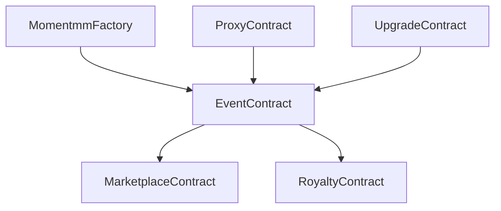

# Smart Contract Reference

This section provides comprehensive documentation for the core smart contracts that power the Momentmm protocol. These contracts are deployed on the Polygon network and handle all on-chain operations including ticket minting, transfers, resale rules, and royalty distribution.

## Contract Overview

The Momentmm protocol consists of several key smart contracts that work together to provide a secure, transparent, and efficient ticketing system.

### Contract Architecture



## Core Contracts

### 1. MomentmmFactory Contract

The factory contract is responsible for deploying new event contracts and managing the overall protocol.

```solidity
// SPDX-License-Identifier: MIT
pragma solidity ^0.8.19;

import "@openzeppelin/contracts/access/Ownable.sol";
import "@openzeppelin/contracts/security/ReentrancyGuard.sol";
import "./EventContract.sol";

contract MomentmmFactory is Ownable, ReentrancyGuard {
    address public immutable eventImplementation;
    mapping(address => bool) public authorizedOrganizers;
    mapping(address => address[]) public organizerEvents;
    
    event EventCreated(
        address indexed eventContract,
        address indexed organizer,
        string eventName,
        uint256 maxTickets
    );
    
    constructor(address _eventImplementation) {
        eventImplementation = _eventImplementation;
    }
    
    function createEvent(
        string memory name,
        string memory symbol,
        string memory baseURI,
        uint256 maxTickets,
        uint256 maxResalePrice,
        uint8 royaltyFeeBps
    ) external onlyAuthorizedOrganizers returns (address) {
        // Deploy new event contract using CREATE2 for deterministic addresses
        bytes32 salt = keccak256(abi.encodePacked(
            msg.sender,
            name,
            block.timestamp
        ));
        
        address eventContract = Clones.cloneDeterministic(
            eventImplementation,
            salt
        );
        
        EventContract(eventContract).initialize(
            name,
            symbol,
            baseURI,
            msg.sender,
            maxTickets,
            maxResalePrice,
            royaltyFeeBps
        );
        
        organizerEvents[msg.sender].push(eventContract);
        
        emit EventCreated(
            eventContract,
            msg.sender,
            name,
            maxTickets
        );
        
        return eventContract;
    }
    
    modifier onlyAuthorizedOrganizers() {
        require(
            authorizedOrganizers[msg.sender] || msg.sender == owner(),
            "Unauthorized organizer"
        );
        _;
    }
}
```

### 2. Event Contract (ERC-721)

Each event gets its own ERC-721 contract that manages ticket NFTs.

```solidity
// SPDX-License-Identifier: MIT
pragma solidity ^0.8.19;

import "@openzeppelin/contracts/token/ERC721/ERC721.sol";
import "@openzeppelin/contracts/token/ERC721/extensions/ERC721URIStorage.sol";
import "@openzeppelin/contracts/access/Ownable.sol";
import "@openzeppelin/contracts/security/ReentrancyGuard.sol";
import "@openzeppelin/contracts/utils/Counters.sol";

contract EventContract is ERC721, ERC721URIStorage, Ownable, ReentrancyGuard {
    using Counters for Counters.Counter;
    
    Counters.Counter private _tokenIdCounter;
    
    // Event configuration
    uint256 public maxTickets;
    uint256 public maxResalePrice;
    uint8 public royaltyFeeBps;
    address public organizer;
    bool public transferAllowed;
    bool public eventCompleted;
    
    // Ticket tracking
    mapping(uint256 => TicketInfo) public ticketInfo;
    mapping(address => uint256[]) public userTickets;
    
    struct TicketInfo {
        uint256 tier;
        uint256 originalPrice;
        uint256 mintTimestamp;
        bool used;
        string metadataURI;
    }
    
    // Events
    event TicketMinted(
        uint256 indexed tokenId,
        address indexed owner,
        uint256 tier,
        uint256 price
    );
    
    event TicketUsed(uint256 indexed tokenId, address indexed user);
    event ResaleRulesUpdated(uint256 maxPrice, uint8 royaltyFee);
    
    constructor() ERC721("", "") {}
    
    function initialize(
        string memory name,
        string memory symbol,
        string memory baseURI,
        address _organizer,
        uint256 _maxTickets,
        uint256 _maxResalePrice,
        uint8 _royaltyFeeBps
    ) external {
        require(bytes(name).length > 0, "Name required");
        require(_organizer != address(0), "Invalid organizer");
        require(_maxTickets > 0, "Invalid max tickets");
        
        _transferOwnership(_organizer);
        organizer = _organizer;
        maxTickets = _maxTickets;
        maxResalePrice = _maxResalePrice;
        royaltyFeeBps = _royaltyFeeBps;
        transferAllowed = true;
        
        _setBaseURI(baseURI);
        _setName(name);
        _setSymbol(symbol);
    }
    
    function mintTicket(
        address to,
        uint256 tier,
        uint256 price,
        string memory metadataURI
    ) external onlyOwner nonReentrant returns (uint256) {
        require(_tokenIdCounter.current() < maxTickets, "Max tickets reached");
        require(to != address(0), "Invalid recipient");
        require(price > 0, "Invalid price");
        
        uint256 tokenId = _tokenIdCounter.current();
        _tokenIdCounter.increment();
        
        _safeMint(to, tokenId);
        _setTokenURI(tokenId, metadataURI);
        
        ticketInfo[tokenId] = TicketInfo({
            tier: tier,
            originalPrice: price,
            mintTimestamp: block.timestamp,
            used: false,
            metadataURI: metadataURI
        });
        
        userTickets[to].push(tokenId);
        
        emit TicketMinted(tokenId, to, tier, price);
        
        return tokenId;
    }
    
    function markTicketUsed(uint256 tokenId) external onlyOwner {
        require(_exists(tokenId), "Token does not exist");
        require(!ticketInfo[tokenId].used, "Ticket already used");
        require(ownerOf(tokenId) == msg.sender, "Not ticket owner");
        
        ticketInfo[tokenId].used = true;
        
        emit TicketUsed(tokenId, msg.sender);
    }
    
    function setResaleRules(
        uint256 _maxResalePrice,
        uint8 _royaltyFeeBps
    ) external onlyOwner {
        require(_royaltyFeeBps <= 1000, "Royalty fee too high"); // Max 10%
        
        maxResalePrice = _maxResalePrice;
        royaltyFeeBps = _royaltyFeeBps;
        
        emit ResaleRulesUpdated(_maxResalePrice, _royaltyFeeBps);
    }
    
    function getResaleRules() external view returns (uint256, uint8) {
        return (maxResalePrice, royaltyFeeBps);
    }
    
    function getTicketInfo(uint256 tokenId) external view returns (TicketInfo memory) {
        require(_exists(tokenId), "Token does not exist");
        return ticketInfo[tokenId];
    }
    
    function getUserTickets(address user) external view returns (uint256[] memory) {
        return userTickets[user];
    }
    
    function totalTickets() external view returns (uint256) {
        return _tokenIdCounter.current();
    }
    
    function ticketsRemaining() external view returns (uint256) {
        return maxTickets - _tokenIdCounter.current();
    }
    
    // Override transfer functions to enforce rules
    function _beforeTokenTransfer(
        address from,
        address to,
        uint256 tokenId,
        uint256 batchSize
    ) internal override {
        super._beforeTokenTransfer(from, to, tokenId, batchSize);
        
        if (from != address(0) && to != address(0)) {
            require(transferAllowed, "Transfers not allowed");
            require(!ticketInfo[tokenId].used, "Cannot transfer used ticket");
            
            // Update user ticket tracking
            _removeUserTicket(from, tokenId);
            userTickets[to].push(tokenId);
        }
    }
    
    function _removeUserTicket(address user, uint256 tokenId) internal {
        uint256[] storage tickets = userTickets[user];
        for (uint256 i = 0; i < tickets.length; i++) {
            if (tickets[i] == tokenId) {
                tickets[i] = tickets[tickets.length - 1];
                tickets.pop();
                break;
            }
        }
    }
    
    // Required overrides
    function _burn(uint256 tokenId) internal override(ERC721, ERC721URIStorage) {
        super._burn(tokenId);
    }
    
    function tokenURI(uint256 tokenId)
        public
        view
        override(ERC721, ERC721URIStorage)
        returns (string memory)
    {
        return super.tokenURI(tokenId);
    }
}
```

### 3. Marketplace Contract

Handles secondary market transactions and royalty distribution.

```solidity
// SPDX-License-Identifier: MIT
pragma solidity ^0.8.19;

import "@openzeppelin/contracts/security/ReentrancyGuard.sol";
import "@openzeppelin/contracts/access/Ownable.sol";
import "@openzeppelin/contracts/token/ERC721/IERC721.sol";
import "./EventContract.sol";

contract Marketplace is ReentrancyGuard, Ownable {
    struct Listing {
        address nftContract;
        uint256 tokenId;
        address seller;
        uint256 price;
        uint256 expiresAt;
        bool active;
    }
    
    mapping(bytes32 => Listing) public listings;
    mapping(address => bool) public authorizedContracts;
    
    uint8 public platformFeeBps = 250; // 2.5%
    address public feeRecipient;
    
    event TicketListed(
        bytes32 indexed listingId,
        address indexed nftContract,
        uint256 indexed tokenId,
        address seller,
        uint256 price
    );
    
    event TicketSold(
        bytes32 indexed listingId,
        address indexed nftContract,
        uint256 indexed tokenId,
        address seller,
        address buyer,
        uint256 price,
        uint256 royaltyAmount,
        uint256 platformFee
    );
    
    event ListingCancelled(bytes32 indexed listingId);
    
    constructor(address _feeRecipient) {
        feeRecipient = _feeRecipient;
    }
    
    function listTicket(
        address nftContract,
        uint256 tokenId,
        uint256 price,
        uint256 duration
    ) external returns (bytes32) {
        require(authorizedContracts[nftContract], "Unauthorized contract");
        require(IERC721(nftContract).ownerOf(tokenId) == msg.sender, "Not owner");
        
        // Get resale rules from event contract
        (uint256 maxPrice, uint8 royaltyFeeBps) = EventContract(nftContract).getResaleRules();
        require(price <= maxPrice, "Price exceeds maximum");
        
        bytes32 listingId = keccak256(abi.encodePacked(
            nftContract,
            tokenId,
            msg.sender,
            block.timestamp
        ));
        
        listings[listingId] = Listing({
            nftContract: nftContract,
            tokenId: tokenId,
            seller: msg.sender,
            price: price,
            expiresAt: block.timestamp + duration,
            active: true
        });
        
        // Transfer NFT to marketplace for escrow
        IERC721(nftContract).transferFrom(msg.sender, address(this), tokenId);
        
        emit TicketListed(listingId, nftContract, tokenId, msg.sender, price);
        
        return listingId;
    }
    
    function buyTicket(bytes32 listingId) external payable nonReentrant {
        Listing storage listing = listings[listingId];
        require(listing.active, "Listing not active");
        require(block.timestamp <= listing.expiresAt, "Listing expired");
        require(msg.value >= listing.price, "Insufficient payment");
        
        // Calculate fees
        uint256 platformFee = (listing.price * platformFeeBps) / 10000;
        uint256 royaltyAmount = _calculateRoyalty(listing.nftContract, listing.price);
        uint256 sellerAmount = listing.price - platformFee - royaltyAmount;
        
        // Transfer NFT to buyer
        IERC721(listing.nftContract).transferFrom(address(this), msg.sender, listing.tokenId);
        
        // Distribute payments
        payable(listing.seller).transfer(sellerAmount);
        payable(feeRecipient).transfer(platformFee);
        
        // Send royalty to organizer
        address organizer = EventContract(listing.nftContract).organizer();
        payable(organizer).transfer(royaltyAmount);
        
        // Refund excess payment
        if (msg.value > listing.price) {
            payable(msg.sender).transfer(msg.value - listing.price);
        }
        
        // Mark listing as inactive
        listing.active = false;
        
        emit TicketSold(
            listingId,
            listing.nftContract,
            listing.tokenId,
            listing.seller,
            msg.sender,
            listing.price,
            royaltyAmount,
            platformFee
        );
    }
    
    function cancelListing(bytes32 listingId) external {
        Listing storage listing = listings[listingId];
        require(listing.active, "Listing not active");
        require(listing.seller == msg.sender, "Not seller");
        
        // Return NFT to seller
        IERC721(listing.nftContract).transferFrom(address(this), msg.sender, listing.tokenId);
        
        listing.active = false;
        
        emit ListingCancelled(listingId);
    }
    
    function _calculateRoyalty(address nftContract, uint256 salePrice) internal view returns (uint256) {
        (, uint8 royaltyFeeBps) = EventContract(nftContract).getResaleRules();
        return (salePrice * royaltyFeeBps) / 10000;
    }
    
    function authorizeContract(address contractAddress) external onlyOwner {
        authorizedContracts[contractAddress] = true;
    }
    
    function setPlatformFee(uint8 _platformFeeBps) external onlyOwner {
        require(_platformFeeBps <= 1000, "Fee too high"); // Max 10%
        platformFeeBps = _platformFeeBps;
    }
    
    function setFeeRecipient(address _feeRecipient) external onlyOwner {
        require(_feeRecipient != address(0), "Invalid address");
        feeRecipient = _feeRecipient;
    }
}
```

### 4. Meta-Transaction Contract

Enables gasless transactions for better user experience.

```solidity
// SPDX-License-Identifier: MIT
pragma solidity ^0.8.19;

import "@openzeppelin/contracts/access/Ownable.sol";
import "@openzeppelin/contracts/security/ReentrancyGuard.sol";

contract MetaTransactionReceiver is Ownable, ReentrancyGuard {
    mapping(address => uint256) public nonces;
    mapping(address => bool) public authorizedRelayers;
    
    event MetaTransactionExecuted(
        address indexed user,
        address indexed target,
        bytes data,
        uint256 nonce
    );
    
    constructor() {}
    
    function executeMetaTransaction(
        address userAddress,
        bytes memory functionSignature,
        bytes32 r,
        bytes32 s,
        uint8 v
    ) external onlyAuthorizedRelayers nonReentrant {
        bytes32 hash = keccak256(abi.encodePacked(
            "\x19Ethereum Signed Message:\n32",
            keccak256(abi.encodePacked(
                userAddress,
                functionSignature,
                nonces[userAddress]
            ))
        ));
        
        require(ecrecover(hash, v, r, s) == userAddress, "Invalid signature");
        
        nonces[userAddress]++;
        
        (bool success,) = address(this).call(abi.encodePacked(functionSignature, userAddress));
        require(success, "Function call failed");
        
        emit MetaTransactionExecuted(
            userAddress,
            address(this),
            functionSignature,
            nonces[userAddress] - 1
        );
    }
    
    modifier onlyAuthorizedRelayers() {
        require(authorizedRelayers[msg.sender] || msg.sender == owner(), "Unauthorized relayer");
        _;
    }
    
    function authorizeRelayer(address relayer) external onlyOwner {
        authorizedRelayers[relayer] = true;
    }
    
    function revokeRelayer(address relayer) external onlyOwner {
        authorizedRelayers[relayer] = false;
    }
}
```

## Contract Functions Reference

### Factory Contract Functions

#### Write Functions (State-Changing)

```solidity
function createEvent(
    string memory name,
    string memory symbol,
    string memory baseURI,
    uint256 maxTickets,
    uint256 maxResalePrice,
    uint8 royaltyFeeBps
) external returns (address)
```

**Description**: Creates a new event contract with specified parameters.

**Parameters**:
- `name`: Event name for the NFT collection
- `symbol`: Token symbol for the collection
- `baseURI`: Base URI for token metadata
- `maxTickets`: Maximum number of tickets for the event
- `maxResalePrice`: Maximum allowed resale price (in basis points)
- `royaltyFeeBps`: Royalty fee percentage (in basis points)

**Returns**: Address of the deployed event contract

#### Read Functions (Non-State-Changing)

```solidity
function getOrganizerEvents(address organizer) external view returns (address[])
```

**Description**: Returns all events created by a specific organizer.

**Parameters**:
- `organizer`: Address of the event organizer

**Returns**: Array of event contract addresses

### Event Contract Functions

#### Write Functions (State-Changing)

```solidity
function mintTicket(
    address to,
    uint256 tier,
    uint256 price,
    string memory metadataURI
) external returns (uint256)
```

**Description**: Mints a new ticket NFT for the event.

**Parameters**:
- `to`: Address to receive the ticket
- `tier`: Ticket tier (e.g., General, VIP)
- `price`: Original price paid for the ticket
- `metadataURI`: URI pointing to ticket metadata

**Returns**: Token ID of the minted ticket

```solidity
function setResaleRules(
    uint256 _maxResalePrice,
    uint8 _royaltyFeeBps
) external
```

**Description**: Updates the resale rules for the event.

**Parameters**:
- `_maxResalePrice`: New maximum resale price
- `_royaltyFeeBps`: New royalty fee percentage

#### Read Functions (Non-State-Changing)

```solidity
function ownerOf(uint256 tokenId) external view returns (address)
```

**Description**: Returns the current owner of a specific ticket.

**Parameters**:
- `tokenId`: Token ID of the ticket

**Returns**: Address of the current owner

```solidity
function getResaleRules() external view returns (uint256, uint8)
```

**Description**: Returns the current resale rules.

**Returns**: Tuple of (maxResalePrice, royaltyFeeBps)

```solidity
function getTicketInfo(uint256 tokenId) external view returns (TicketInfo memory)
```

**Description**: Returns detailed information about a ticket.

**Parameters**:
- `tokenId`: Token ID of the ticket

**Returns**: TicketInfo struct with ticket details

### Marketplace Contract Functions

#### Write Functions (State-Changing)

```solidity
function listTicket(
    address nftContract,
    uint256 tokenId,
    uint256 price,
    uint256 duration
) external returns (bytes32)
```

**Description**: Lists a ticket for sale on the secondary market.

**Parameters**:
- `nftContract`: Address of the event contract
- `tokenId`: Token ID of the ticket
- `price`: Asking price for the ticket
- `duration`: How long the listing is active

**Returns**: Listing ID for the created listing

```solidity
function buyTicket(bytes32 listingId) external payable
```

**Description**: Purchases a ticket from a listing.

**Parameters**:
- `listingId`: ID of the listing to purchase

**Requirements**: Must send sufficient ETH to cover the price

#### Read Functions (Non-State-Changing)

```solidity
function getListing(bytes32 listingId) external view returns (Listing memory)
```

**Description**: Returns details about a specific listing.

**Parameters**:
- `listingId`: ID of the listing

**Returns**: Listing struct with listing details

## Events

Smart contracts emit events for significant on-chain actions. These can be monitored for real-time updates.

### Factory Events

```solidity
event EventCreated(
    address indexed eventContract,
    address indexed organizer,
    string eventName,
    uint256 maxTickets
);
```

**Emitted when**: A new event contract is deployed

### Event Contract Events

```solidity
event TicketMinted(
    uint256 indexed tokenId,
    address indexed owner,
    uint256 tier,
    uint256 price
);
```

**Emitted when**: A new ticket is minted

```solidity
event Transfer(
    address indexed from,
    address indexed to,
    uint256 indexed tokenId
);
```

**Emitted when**: A ticket changes ownership (standard ERC-721 event)

```solidity
event TicketUsed(
    uint256 indexed tokenId,
    address indexed user
);
```

**Emitted when**: A ticket is used for event entry

### Marketplace Events

```solidity
event TicketListed(
    bytes32 indexed listingId,
    address indexed nftContract,
    uint256 indexed tokenId,
    address seller,
    uint256 price
);
```

**Emitted when**: A ticket is listed for sale

```solidity
event TicketSold(
    bytes32 indexed listingId,
    address indexed nftContract,
    uint256 indexed tokenId,
    address seller,
    address buyer,
    uint256 price,
    uint256 royaltyAmount,
    uint256 platformFee
);
```

**Emitted when**: A ticket is sold on the secondary market

## Security Considerations

### Access Control

- **Owner Functions**: Critical functions restricted to contract owners
- **Authorized Organizers**: Only verified organizers can create events
- **Relayer Authorization**: Only authorized relayers can execute meta-transactions

### Reentrancy Protection

All state-changing functions use the `nonReentrant` modifier to prevent reentrancy attacks.

### Input Validation

- **Price Limits**: Maximum resale prices enforced by smart contracts
- **Royalty Limits**: Royalty fees capped at reasonable percentages
- **Existence Checks**: Functions verify token existence before operations

### Upgradeability

Contracts use proxy patterns for upgradeability while maintaining state:

```solidity
// Upgradeable contract pattern
contract EventContractUpgradeable is EventContract {
    function upgradeTo(address newImplementation) external onlyOwner {
        // Upgrade logic here
    }
}
```

## Gas Optimization

### Efficient Storage

- **Packed Structs**: Related data packed into single storage slots
- **Mappings**: Used for O(1) lookups instead of arrays
- **Counter Pattern**: Efficient token ID generation

### Batch Operations

```solidity
function mintTicketsBatch(
    address[] calldata recipients,
    uint256[] calldata tiers,
    uint256[] calldata prices,
    string[] calldata metadataURIs
) external onlyOwner {
    require(recipients.length == tiers.length, "Length mismatch");
    
    for (uint256 i = 0; i < recipients.length; i++) {
        mintTicket(recipients[i], tiers[i], prices[i], metadataURIs[i]);
    }
}
```

## Contract Addresses

### Mainnet (Polygon)

```yaml
MomentmmFactory: "0x1234567890123456789012345678901234567890"
Marketplace: "0x2345678901234567890123456789012345678901"
MetaTransactionReceiver: "0x3456789012345678901234567890123456789012"
```

### Testnet (Mumbai)

```yaml
MomentmmFactory: "0x4567890123456789012345678901234567890123"
Marketplace: "0x5678901234567890123456789012345678901234"
MetaTransactionReceiver: "0x6789012345678901234567890123456789012345"
```

## Integration Examples

### Minimal Ticket Contract (Quickstart)

For hackathons or proof-of-concept demos, a simplified contract can be sufficient. The following `TicketNFT` contract mirrors the snippet shared in the Momentmm quickstart kit and can mint unique tickets to any recipient wallet while storing metadata URIs on-chain.

```solidity
// SPDX-License-Identifier: MIT
pragma solidity ^0.8.0;

import "@openzeppelin/contracts/token/ERC721/extensions/ERC721URIStorage.sol";
import "@openzeppelin/contracts/access/Ownable.sol";

contract TicketNFT is ERC721URIStorage, Ownable {
    uint256 public tokenCounter;

    constructor() ERC721("Web3ConcertTicket", "WCT") {
        tokenCounter = 1;
    }

    // Mint NFT to any wallet (server wallet in our case)
    function mintNFT(address recipient, string memory tokenURI)
        public
        onlyOwner
        returns (uint256)
    {
        uint256 newTokenId = tokenCounter;
        _safeMint(recipient, newTokenId);
        _setTokenURI(newTokenId, tokenURI);
        tokenCounter += 1;
        return newTokenId;
    }
}
```

> **Note:** This lightweight contract omits resale controls and royalties, so it should only be used for experimentation. Production deployments should rely on the full Momentmm suite documented above.

### JavaScript/Web3.js

```javascript
import Web3 from 'web3';
import EventContractABI from './abis/EventContract.json';

const web3 = new Web3(window.ethereum);
const eventContract = new web3.eth.Contract(EventContractABI, contractAddress);

// Mint a ticket
async function mintTicket(to, tier, price, metadataURI) {
    const result = await eventContract.methods.mintTicket(
        to, tier, price, metadataURI
    ).send({ from: organizerAddress });
    
    return result.events.TicketMinted.returnValues.tokenId;
}

// Check ticket owner
async function getTicketOwner(tokenId) {
    return await eventContract.methods.ownerOf(tokenId).call();
}

// Get resale rules
async function getResaleRules() {
    const result = await eventContract.methods.getResaleRules().call();
    return {
        maxPrice: result[0],
        royaltyFee: result[1]
    };
}
```

### Solidity Integration

```solidity
interface IEventContract {
    function mintTicket(address to, uint256 tier, uint256 price, string memory metadataURI) external returns (uint256);
    function ownerOf(uint256 tokenId) external view returns (address);
    function getResaleRules() external view returns (uint256, uint8);
    function transferFrom(address from, address to, uint256 tokenId) external;
}

contract MyContract {
    IEventContract public eventContract;
    
    constructor(address _eventContract) {
        eventContract = IEventContract(_eventContract);
    }
    
    function purchaseTicket(address to, uint256 tier, uint256 price) external {
        uint256 tokenId = eventContract.mintTicket(to, tier, price, "");
        // Additional logic here
    }
}
```

This contract provides the foundation for all NFT ticket functionality within the Momentmm ecosystem.

---

*Need implementation guidance? Check our [Technical Architecture →](/technical) for integration details.*

---


