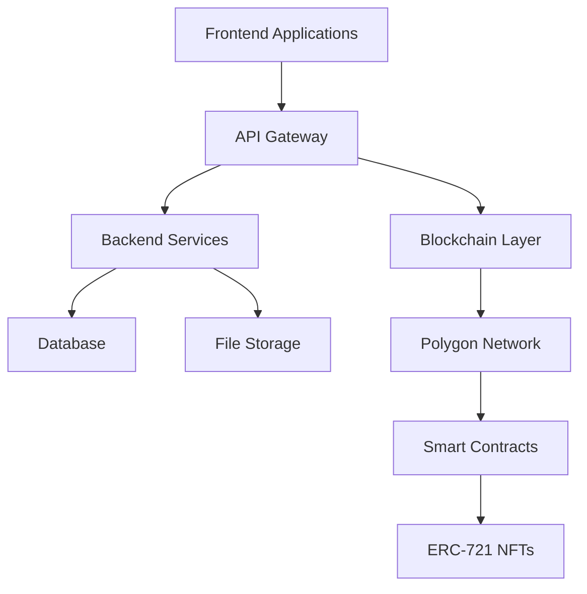
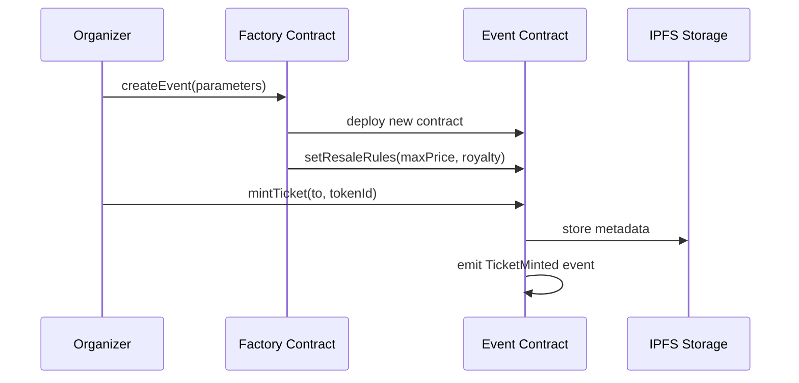
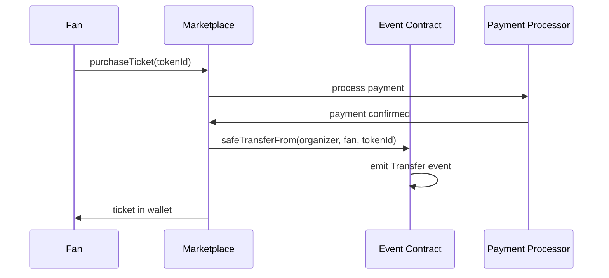
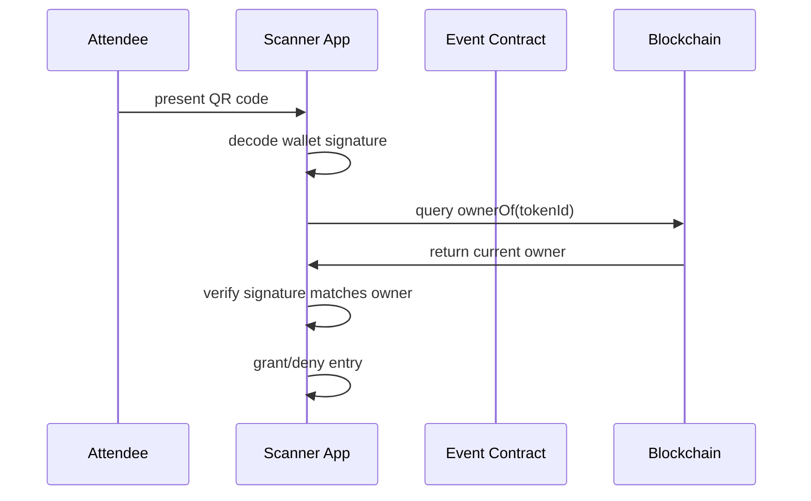
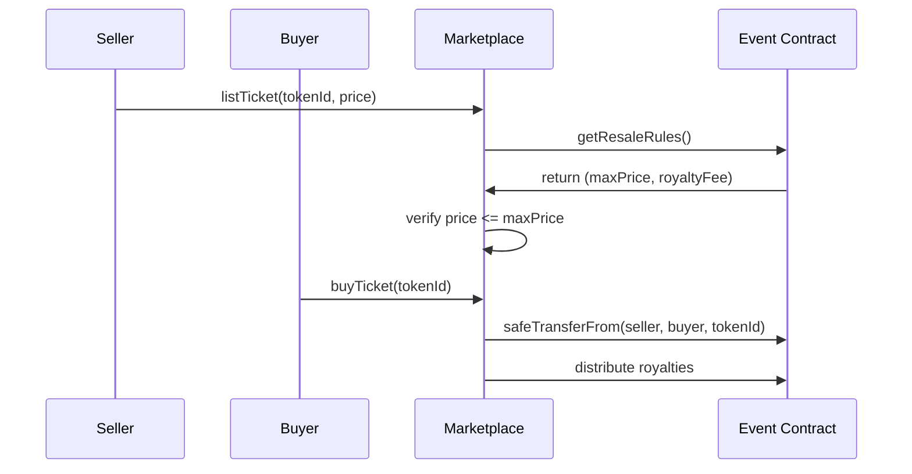

# Technical Documentation

This section provides a comprehensive technical overview of the Momentmm protocol, its underlying blockchain infrastructure, and the core architectural decisions designed to ensure scalability, security, and seamless user experience.

## Architecture Overview

Momentmm is built on a hybrid architecture that combines the security and decentralization of blockchain technology with the performance and user experience of modern web applications.

### Core Components



### Technology Stack

- **Frontend**: React, Next.js, TypeScript
- **Backend**: Node.js, Express, TypeScript
- **Blockchain**: Polygon (EVM-compatible)
- **Smart Contracts**: Solidity
- **Database**: PostgreSQL with Redis caching
- **File Storage**: IPFS for metadata and artwork
- **Authentication**: JWT with wallet signatures

## Blockchain Infrastructure

### Why Polygon?

Momentmm is built on Polygon, a leading Layer-2 scaling solution for Ethereum. This choice addresses the key challenges of building a mainstream, high-volume consumer application.

#### Key Benefits

**High Throughput**
- Processes significantly more transactions per second than Ethereum mainnet
- Handles peak demand during popular ticket drops without congestion
- Supports thousands of concurrent users during high-demand events

**Low Transaction Fees**
- Transaction costs are fractions of a cent
- Essential for economic viability of minting large NFT quantities
- Enables low-cost secondary market trades
- Makes micro-transactions feasible

**EVM Compatibility**
- Fully compatible with Ethereum Virtual Machine
- Smart contracts written for Ethereum deploy on Polygon with minimal changes
- Leverages vast ecosystem of Ethereum developer tools
- Benefits from established security standards and best practices

**Robust Security**
- Commit chain to Ethereum benefits from mainnet security
- Operates as more scalable parallel chain
- Optimal balance of security and performance
- Regular security audits and monitoring

### Network Specifications

```yaml
Polygon Network Details:
  Consensus: Proof of Stake (PoS)
  Block Time: ~2 seconds
  Transaction Finality: ~30 seconds
  Gas Price: ~1 Gwei (extremely low)
  EVM Compatibility: Full compatibility
  Bridge: Native bridge to Ethereum
```

## Smart Contract Architecture

### Core Contracts

The Momentmm protocol consists of several key smart contracts deployed on Polygon:

#### 1. MomentmmFactory Contract

```solidity
contract MomentmmFactory {
    function createEvent(
        string memory name,
        string memory symbol,
        string memory baseURI,
        address organizer,
        uint256 maxTickets,
        uint256 maxPrice,
        uint8 royaltyFeeBps
    ) external returns (address);
}
```

**Purpose**: Factory contract for deploying individual event contracts
**Features**:
- One-click event deployment
- Standardized contract templates
- Gas-efficient batch operations
- Upgradeable contract logic

#### 2. Event Contract (ERC-721)

Each event gets its own ERC-721 contract instance:

```solidity
contract EventContract is ERC721, Ownable {
    // Core ticket functions
    function mintTicket(address to, uint256 tokenId) external;
    function setResaleRules(uint256 maxPrice, uint8 royaltyFeeBps) external;
    
    // Verification functions
    function ownerOf(uint256 tokenId) external view returns (address);
    function getResaleRules() external view returns (uint256, uint8);
    
    // Royalty functions
    function royaltyInfo(uint256 tokenId, uint256 salePrice) 
        external view returns (address, uint256);
}
```

**Purpose**: Individual event ticket management
**Features**:
- ERC-721 standard compliance
- Custom resale rules enforcement
- Automated royalty distribution
- Event-specific metadata

#### 3. Marketplace Contract

```solidity
contract Marketplace {
    function listTicket(
        address nftContract,
        uint256 tokenId,
        uint256 price
    ) external;
    
    function buyTicket(
        address nftContract,
        uint256 tokenId
    ) external payable;
    
    function executeResale(
        address nftContract,
        uint256 tokenId,
        uint256 price,
        bytes memory signature
    ) external;
}
```

**Purpose**: Secondary market operations
**Features**:
- Automated price cap enforcement
- Instant royalty distribution
- Meta-transaction support
- Dispute resolution mechanisms

## NFT Ticket Lifecycle

### 1. Minting Process



**Technical Details**:
- Each ticket gets unique `tokenId`
- Metadata stored on IPFS with immutable hash
- Initial ownership assigned to organizer
- Resale rules embedded in contract

### 2. Primary Sale Process



**Technical Details**:
- Atomic transaction ensures payment before transfer
- Payment processed off-chain for speed
- On-chain transfer provides ownership proof
- Gas fees covered by platform for user experience

### 3. Verification Process



**Technical Details**:
- Dynamic QR codes prevent screenshot fraud
- Wallet signature proves ownership
- Blockchain query confirms current owner
- Instant verification with gas-free read operations

### 4. Secondary Market Process



**Technical Details**:
- Price cap enforcement prevents scalping
- Automated royalty distribution
- Atomic transactions ensure security
- All operations recorded on blockchain

## Gasless Transactions (Meta-Transactions)

One of the most significant barriers to mainstream Web3 adoption is the concept of gas fees. Momentmm solves this through meta-transactions, creating a gasless experience for end-users.

### Technical Implementation

```solidity
contract MetaTransactionReceiver {
    function executeMetaTransaction(
        address userAddress,
        bytes memory functionSignature,
        bytes32 r,
        bytes32 s,
        uint8 v
    ) external payable {
        bytes32 hash = keccak256(abi.encodePacked(
            "\x19Ethereum Signed Message:\n32",
            keccak256(abi.encodePacked(
                userAddress,
                functionSignature,
                nonces[userAddress]
            ))
        ));
        
        require(ecrecover(hash, v, r, s) == userAddress, "Invalid signature");
        nonces[userAddress]++;
        
        (bool success,) = address(this).call(abi.encodePacked(functionSignature, userAddress));
        require(success, "Function call failed");
    }
}
```

### Meta-Transaction Flow

1. **User Action**: User initiates action in app (e.g., transfer ticket)
2. **Transaction Construction**: App creates transaction data without sending to blockchain
3. **User Signing**: User signs transaction data with private key (no gas required)
4. **Relayer Submission**: Signed data sent to trusted relayer service
5. **Gas Payment**: Relayer pays MATIC gas fees from platform pool
6. **Execution**: Relayer executes transaction on blockchain
7. **Verification**: Smart contract verifies signature and executes function

### Benefits

- **User Experience**: Seamless Web2-like experience
- **Cost Efficiency**: Platform absorbs gas costs
- **Scalability**: Can handle high-volume operations
- **Accessibility**: No need for users to hold MATIC tokens

## Security Architecture

### Multi-Layer Security

#### 1. Smart Contract Security

```solidity
// Example security measures
contract SecureEventContract {
    modifier onlyOrganizer() {
        require(msg.sender == organizer, "Only organizer");
        _;
    }
    
    modifier validPrice(uint256 price) {
        require(price <= maxResalePrice, "Price exceeds limit");
        _;
    }
    
    modifier nonReentrant() {
        require(!locked, "Reentrant call");
        locked = true;
        _;
        locked = false;
    }
}
```

**Security Features**:
- Access control modifiers
- Reentrancy protection
- Integer overflow/underflow protection
- Price validation mechanisms
- Ownership verification

#### 2. Frontend Security

- **Wallet Integration**: Secure wallet connection protocols
- **Input Validation**: Client-side and server-side validation
- **XSS Protection**: Content Security Policy implementation
- **CSRF Protection**: Anti-forgery token implementation
- **Secure Communication**: HTTPS/TLS encryption

#### 3. Backend Security

- **API Authentication**: JWT tokens with wallet signature verification
- **Rate Limiting**: DDoS protection and abuse prevention
- **Input Sanitization**: SQL injection and XSS prevention
- **Database Security**: Encrypted connections and query parameterization
- **Audit Logging**: Comprehensive activity tracking

### Audit and Monitoring

- **Smart Contract Audits**: Regular third-party security audits
- **Penetration Testing**: Ongoing security vulnerability assessments
- **Monitoring Systems**: Real-time anomaly detection
- **Incident Response**: Rapid response procedures for security issues

## API Architecture

### RESTful API Design

The Momentmm backend provides a comprehensive REST API for all platform operations:

#### Authentication

```http
POST /api/auth/login
Content-Type: application/json

{
  "walletAddress": "0x123...",
  "signature": "0x456...",
  "message": "Login to Momentmm"
}
```

#### Event Management

```http
GET /api/events
Authorization: Bearer <token>

Response:
{
  "data": [
    {
      "id": "evt_123",
      "name": "Concert Name",
      "date": "2024-12-25T19:00:00Z",
      "venue": "Venue Name",
      "totalTickets": 1000,
      "soldTickets": 750
    }
  ],
  "pagination": {
    "page": 1,
    "limit": 20,
    "total": 150
  }
}
```

#### Ticket Operations

```http
GET /api/tickets/owner/{walletAddress}
Authorization: Bearer <token>

Response:
{
  "data": [
    {
      "tokenId": "123",
      "contractAddress": "0x789...",
      "eventName": "Concert Name",
      "eventDate": "2024-12-25T19:00:00Z",
      "tier": "VIP",
      "status": "valid"
    }
  ]
}
```

### Real-time Features

#### WebSocket Integration

```javascript
// Real-time ticket updates
const socket = io('https://api.momentmm.xyz');

socket.on('ticketPurchased', (data) => {
  console.log('New ticket sold:', data);
  updateEventStats(data);
});

socket.on('ticketResold', (data) => {
  console.log('Ticket resold:', data);
  updateSecondaryMarket(data);
});
```

### API Rate Limiting

```yaml
Rate Limits:
  Authentication: 10 requests/minute
  General API: 100 requests/minute
  High-Volume Operations: 1000 requests/minute
  WebSocket Connections: 5 concurrent per user
```

## Database Schema

### Core Tables

#### Events Table

```sql
CREATE TABLE events (
    id UUID PRIMARY KEY,
    organizer_id UUID REFERENCES organizers(id),
    name VARCHAR(255) NOT NULL,
    description TEXT,
    event_date TIMESTAMP WITH TIME ZONE,
    venue VARCHAR(255),
    contract_address VARCHAR(42),
    max_tickets INTEGER,
    created_at TIMESTAMP DEFAULT NOW(),
    updated_at TIMESTAMP DEFAULT NOW()
);
```

#### Tickets Table

```sql
CREATE TABLE tickets (
    id UUID PRIMARY KEY,
    event_id UUID REFERENCES events(id),
    token_id INTEGER NOT NULL,
    owner_address VARCHAR(42) NOT NULL,
    tier VARCHAR(50),
    price DECIMAL(10,2),
    status VARCHAR(20) DEFAULT 'valid',
    created_at TIMESTAMP DEFAULT NOW(),
    updated_at TIMESTAMP DEFAULT NOW()
);
```

#### Transactions Table

```sql
CREATE TABLE transactions (
    id UUID PRIMARY KEY,
    ticket_id UUID REFERENCES tickets(id),
    from_address VARCHAR(42),
    to_address VARCHAR(42) NOT NULL,
    transaction_hash VARCHAR(66) UNIQUE,
    transaction_type VARCHAR(20),
    price DECIMAL(10,2),
    royalty_amount DECIMAL(10,2),
    created_at TIMESTAMP DEFAULT NOW()
);
```

## Performance Optimization

### Caching Strategy

```yaml
Caching Layers:
  Redis: 
    - API responses (5 minutes)
    - User sessions (24 hours)
    - Event metadata (1 hour)
  
  CDN:
    - Static assets (24 hours)
    - Images and artwork (7 days)
    - API responses (1 minute)
  
  Database:
    - Query result caching
    - Connection pooling
    - Read replicas for scaling
```

### Scalability Measures

- **Horizontal Scaling**: Microservices architecture
- **Database Sharding**: Partition data by event or region
- **Load Balancing**: Distribute traffic across multiple servers
- **Auto-scaling**: Dynamic resource allocation based on demand
- **Edge Computing**: Reduce latency with global CDN

## Monitoring and Analytics

### Key Metrics

```yaml
Platform Metrics:
  - Transactions per second
  - Average response time
  - Error rates
  - User engagement
  - Ticket sales velocity
  
Blockchain Metrics:
  - Gas usage patterns
  - Transaction success rates
  - Network congestion
  - Smart contract interactions
  
Business Metrics:
  - Revenue per event
  - Secondary market volume
  - Creator royalty distribution
  - User retention rates
```

### Monitoring Tools

- **Application Performance**: New Relic, DataDog
- **Infrastructure**: AWS CloudWatch, Grafana
- **Blockchain**: The Graph, Alchemy
- **Error Tracking**: Sentry, Bugsnag
- **Analytics**: Mixpanel, Google Analytics

---

*For detailed API documentation, see our [API Reference →](/api)*
