# Technical Architecture

**"The events platform web3 deserves"** - Momentmm combines blockchain technology with AI to create India's premier invite-only platform for Gen Z creatives and culturally engaged professionals.

---

## Platform Overview

Momentmm is built on the principle that web3 should be accessible to everyone and **"owned by a community, not a conglomerate."** Our platform delivers **NFT tickets, micro-investments, and community rewards—all in one place.**

### Core Platform Features

**NFT Tickets**
- Collectible event tickets powered by blockchain technology utilizing ERC-721 standard
- Each ticket represents a unique digital asset with immutable ownership verification
- Tickets serve as both access credentials and post-event memorabilia with provable authenticity
- Free exclusive NFT badges distributed to new users upon platform registration
- Badge variants include cultural and identity-based designs for community personalization and recognition

**AI Assistant**
- Machine learning-powered event discovery engine that analyzes user behavior patterns and preferences
- Collaborative filtering algorithms combined with content-based recommendation systems for enhanced matching
- Natural language processing capabilities for understanding user preferences from interaction data and feedback
- Continuous model training on engagement metrics to improve recommendation accuracy over time
- Personalized event curation based on location, interests, social connections, and past attendance history

**Events Radar**
- Geospatial event discovery system utilizing GPS and location-based services for proximity detection
- Real-time event mapping with proximity-based filtering and intelligent notifications
- Integration with mapping APIs for accurate venue location, navigation assistance, and traffic updates
- Live event status updates including capacity monitoring, timing changes, and cancellation notifications
- Push notification system for nearby events matching user preference profiles and availability

**Event Analytics & Insights**
- Comprehensive data analytics platform providing detailed insights for event organizers and community managers
- Real-time attendance tracking, engagement heatmaps, and demographic analysis with privacy compliance
- Performance metrics including RSVP conversion rates, no-show predictions, and revenue tracking capabilities
- Audience behavior analysis with session duration, interaction patterns, social sharing metrics, and feedback analysis
- Customizable dashboard interfaces with exportable reports, API integration capabilities, and third-party tool connections

---

## System Architecture

### Community-Driven Infrastructure

**Community Hub**
- Social networking platform specifically designed for Gen Z creatives and cultural professionals
- Advanced profile matching algorithms that connect users based on shared interests, geographic location, and event participation history
- Integrated discussion forums, direct messaging systems, and dynamic group formation capabilities with moderation tools
- Invite-only membership model with multi-tiered community verification and quality control mechanisms
- Comprehensive integration with event attendance history to facilitate authentic professional networking and relationship building

**Quick RSVP System**
- Single-click event registration system with optimized user interface and minimal friction design
- Backend integration with smart contract deployment infrastructure for automatic NFT ticket minting and distribution
- Real-time capacity management with intelligent waitlist functionality, overflow handling, and fair allocation algorithms
- Multi-channel payment processing integration supporting fiat currencies, cryptocurrencies, and digital wallet systems
- Automatic confirmation workflows with calendar integration, personalized event reminders, and attendance tracking

**Live Communication Infrastructure**
- Real-time notification system built on WebSocket technology for instant bidirectional communication
- Multi-channel communication architecture including push notifications, in-app alerts, email updates, and SMS integration
- Event-driven architecture designed for handling venue changes, schedule modifications, emergency announcements, and capacity updates
- Granular notification preferences system with user-controlled settings for notification types, frequency, and delivery methods
- Seamless integration with external calendar applications and third-party scheduling tools for comprehensive event management

### Web3 Technology Stack


**Blockchain Integration**
- NFT tickets as collectible digital assets
- Exclusive badge system for community members
- Decentralized ownership model
- Community governance principles

**AI-Powered Features**
- Machine learning for event personalization
- Intelligent matching algorithms
- Behavioral analysis for improved recommendations
- Real-time event discovery optimization

---

## Web3 + AI Platform Overview

Momentmm is built on the principle that web3 should be accessible to everyone and **"owned by a community, not a conglomerate."** Our platform delivers **NFT tickets, micro-investments, and community rewards—all in one place.**

### Core Web3 Features

**🎫 NFT Tickets**
- Collectible event tickets powered by blockchain technology
- Each ticket is a unique digital asset with verifiable ownership
- Free exclusive NFT badges for new users (Male/Female variants)

**🤖 AI Assistant**  
- Intelligent event discovery that learns user preferences
- Personalized recommendations for curated experiences
- Machine learning algorithms for optimal matching

**📡 Events Radar**
- Real-time location-based event discovery system  
- Geospatial mapping of nearby experiences
- Live event updates and notifications

**📊 Event Analytics & Insights**
- Track attendance, engagement metrics, and performance data
- Detailed insights about event audience behavior
- Real-time dashboard for organizers

### Blockchain Infrastructure

Momentmm leverages blockchain technology to ensure:
- **Transparent ownership** of NFT tickets and badges
- **Verifiable scarcity** for exclusive events and collectibles  
- **Community governance** through decentralized ownership
- **Authentic digital assets** that users truly own

This chapter distills the architectural decisions behind the Momentmm protocol, mirroring Part III of the master documentation. It explains why we build on Polygon, how on-chain and off-chain services interact, and how gasless execution keeps the user experience frictionless.

---

## 5.1 The Momentmm Protocol on Polygon

Momentmm is deployed on **Polygon PoS**, a Layer‑2 network that delivers Ethereum-grade security with mainstream-ready performance.

- **High throughput:** ~2 second block times comfortably absorb surges during high-demand drops.
- **Low fees:** Typical gas costs are fractions of a cent, keeping minting and transfers economically viable for large ticket inventories.
- **EVM parity:** Contracts written for Ethereum run unchanged, letting us leverage mature tooling, audits, and community expertise.
- **Security posture:** Polygon periodically checkpoints to Ethereum, inheriting mainnet security guarantees while maintaining scalability.

```yaml
Polygon Snapshot:
  Consensus: Proof of Stake (Bor + Heimdall)
  Average Gas Price: ~1 Gwei
  Finality: ~30 seconds
  Native Token: MATIC (used for validator fees and staking)
```

Event metadata and artwork hashes are stored on decentralized storage (IPFS/Filecoin), ensuring ticket authenticity remains verifiable even outside Momentmm’s interfaces.

---

## 5.2 Platform Architecture & Smart Contracts

Momentmm pairs a modern web stack with an opinionated set of smart contracts that govern each stage of the ticket lifecycle.

```mermaid
graph TB
    A[Client Apps
    • Organizer Dashboard
    • Fan Mobile App] --> B(API Gateway)
    B --> C[Application Services
    • Event orchestration
    • Payments & KYC
    • Analytics pipeline]
    B --> D[Blockchain Adapters]
    C --> E[(PostgreSQL + Redis)]
    C --> F[Object Storage / IPFS]
    D --> G[Polygon Network]
    G --> H[Smart Contracts
    • Factory
    • Event NFTs
    • Marketplace]
```



### Contract Suite

1. **Factory Contract** – Deploys event-specific ERC‑721 contracts with preconfigured metadata, pricing tiers, and resale parameters.
2. **Event Contract** – Owns the ticket NFTs, enforces organizer-defined rules (price caps, transfer windows, royalty splits), and exposes view functions for scanners and analytics.
3. **Marketplace Contract** – Facilitates primary issuance and secondary listings. It validates price ceilings, orchestrates royalty payouts, and supports meta-transactions for gasless UX.

Each smart contract emits detailed events (e.g., `TicketMinted`, `TicketTransferred`, `RoyaltyPaid`) which feed into the analytics pipeline for future integrations.

### Off-Chain Services

- **Payments Service:** Handles fiat checkout (UPI, cards, digital wallets) and reconciles settlements back to organizer wallets.
- **Identity/KYC:** Optional modules for regulated events that require attendee verification before ticket transfer.
- **Analytics Engine:** Streams on-chain and off-chain events into real-time dashboards surfaced in the organizer portal.

---

## 5.3 Gasless Execution & Meta-Transactions

True mainstream adoption demands that fans interact without ever seeing a gas prompt. Momentmm achieves this through a **meta-transaction relayer network**.

1. **User intent:** The mobile app constructs a transaction payload (e.g., transfer ticket, list for resale) and prompts the user to sign it. Signing proves intent but costs no gas.
2. **Relayer submission:** A trusted relayer verifies the signature, attaches the appropriate gas fee, and forwards the transaction to Polygon.
3. **On-chain execution:** The smart contract validates the signature, checks nonces to prevent replay, enforces rule compliance, and executes the requested function.

```solidity
function executeMetaTransaction(
  address from,
  bytes memory functionSignature,
  bytes32 r,
  bytes32 s,
  uint8 v
) public payable returns (bytes memory) {
  require(_verify(from, functionSignature, r, s, v), "INVALID_SIGNATURE");
  _useNonce(from);
  (bool success, bytes memory returndata) = address(this).call(
    abi.encodePacked(functionSignature, from)
  );
  require(success, "META_TX_FAILED");
  return returndata;
}
```

### Benefits

- **Web2-like experience:** Fans complete transfers or listings with familiar taps—no MATIC balance required.
- **Centralized cost control:** Organizers (or Momentmm) can subsidize gas strategically, e.g., for first-time users or promotional drops.
- **Replay resistance:** Nonces and domain separators ensure signatures cannot be reused maliciously.
- **Observability:** Relayers push execution receipts into the analytics stream, maintaining full traceability.

---

## Security, Monitoring & Integrations

- **Smart contract audits:** Independent auditors review every release; automated static analysis runs in CI/CD.
- **Operational safeguards:** Role-based access control, hardware security modules (HSM) for treasury keys, and continuous monitoring via services like Alchemy and Tenderly.
- **Data protection:** TLS everywhere, signed webhook payloads, and encryption-at-rest for off-chain PII.
- **Observability:** Structured logs, metric dashboards (Grafana/DataDog), and alerting on on-chain anomalies such as unexpected gas spikes or unauthorized role changes.

---

### Continue Exploring


- **[Smart Contracts](/smart-contracts)** – ABI documentation and integration patterns.
- **[Support](/support)** – Contact channels and escalation paths for technical teams.
